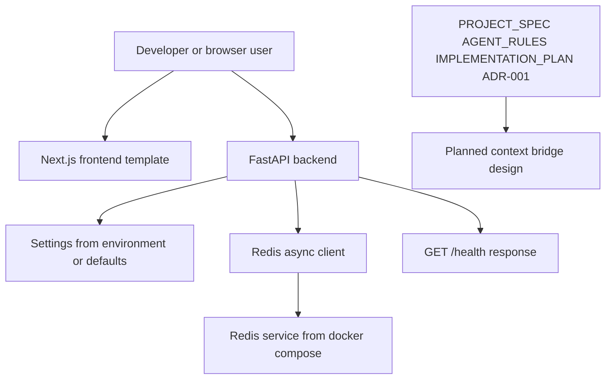
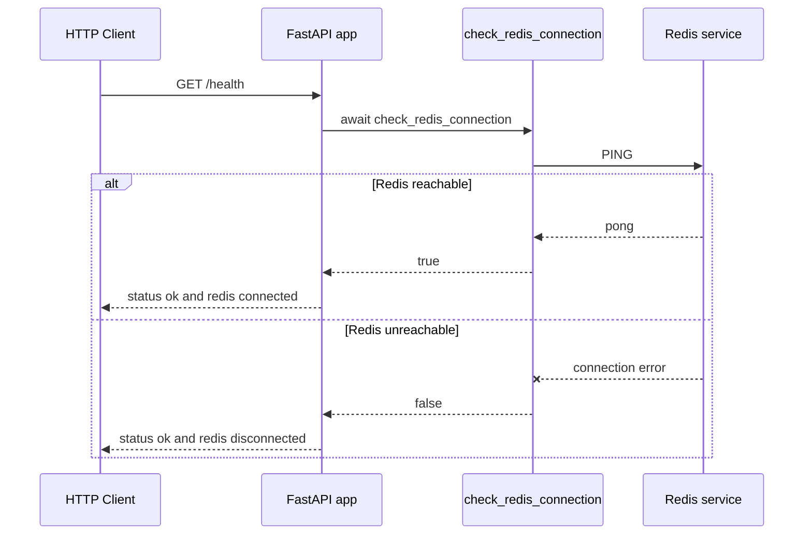

# ContextPortal Architecture Overview

ContextPortal is intended to be an authorization-aware ephemeral context bridge: a user legitimately authenticates to a protected source, ContextPortal retrieves authorized content, normalizes it for agents, and exposes it through a temporary context URL. The current repository is still at bootstrap stage. It contains a FastAPI backend with a Redis-aware health endpoint, a template Next.js frontend, Redis local infrastructure, and architecture documents that define the security and product direction.

For product truth and engineering rules, defer to `PROJECT_SPEC.md`, `AGENT_RULES.md`, `IMPLEMENTATION_PLAN.md`, and `decisions/ADR-001-ephemeral-context.md`. This wiki documents what the code currently implements and where the planned architecture has not yet been built.

## Implemented runtime shape

This diagram shows implemented runtime pieces plus source-of-truth design documents. The future context bridge is documented but not wired into runtime code.

Implemented components:

- **Backend service**: `backend/app/main.py` constructs `FastAPI(title=settings.app_name)` and registers `GET /health`.
- **Redis helper**: `backend/app/redis.py` creates a module-level `redis.asyncio` client from `settings.redis_url` and exposes `check_redis_connection()`.
- **Configuration**: `backend/app/config.py` defines `Settings` with `app_name` and `redis_url`.
- **Frontend app**: `frontend/src/app` is the create-next-app App Router template.
- **Local infrastructure**: `docker-compose.yml` starts Redis only.

## Intended architecture, not yet implemented

The product documents describe a flow from protected resource to authorized retrieval to normalized context to secure temporary URL. ADR-001 narrows the implementation direction: ContextPortal should not become a persistent private-data warehouse. The accepted design is a stateless or ephemeral proxy with Redis for temporary auth sessions, context tokens, expiration, revocation, rate limiting, and short cached content.

The repository does **not** currently implement:

- source connector interfaces;
- browser automation or Playwright;
- authentication-session lifecycle;
- protected URL retrieval;
- SSRF validation;
- content extraction or Markdown normalization;
- context-token generation, hashing, expiration, or revocation;
- `GET /c/{token}` agent retrieval endpoint;
- PostgreSQL models or migrations.

## Current request flow

The only implemented backend request flow is health checking. See [Backend Service](../backend/service.md) for the detailed API and test status.

The health endpoint intentionally returns HTTP 200 even when Redis is disconnected; Redis status is represented in the JSON body.

## Architectural invariant from ADR-001

ADR-001 is the most important architecture decision currently present. It explicitly decides:

- no permanent storage of private webpage or document content;
- no PostgreSQL for now;
- Redis is the temporary-state mechanism;
- first agent request should eventually trigger live fetch through an authenticated session, with short Redis caching for performance.

Future changes should keep the implementation aligned with [Security Boundaries](../security/implemented-boundaries.md) and [Decisions and Status](decisions-and-status.md).