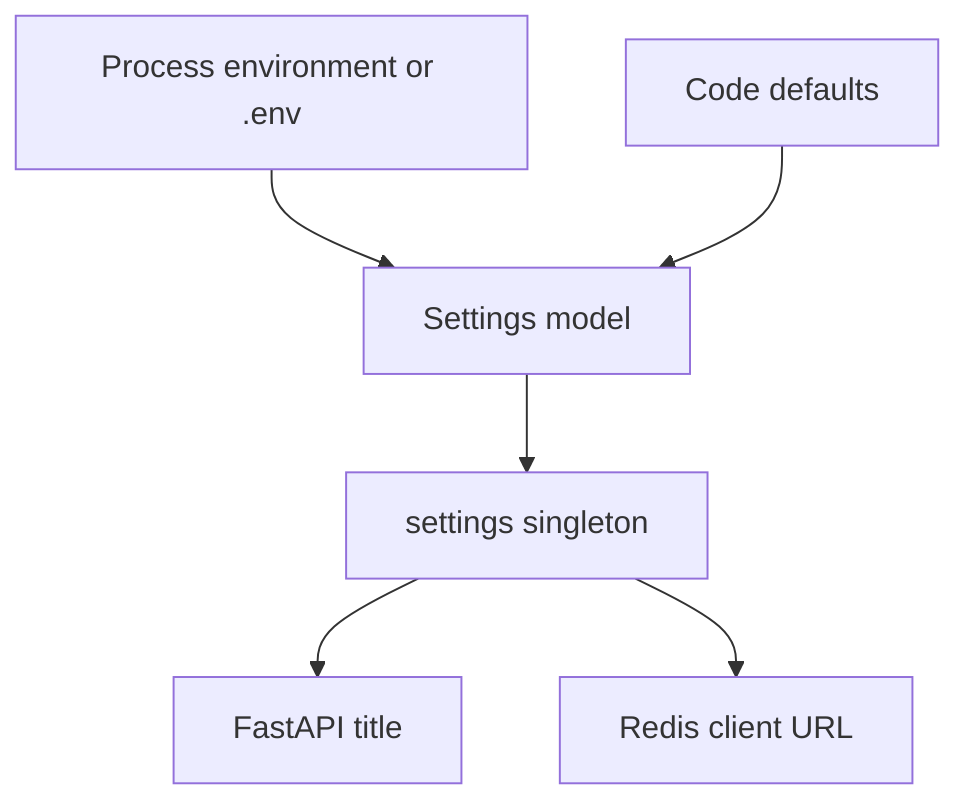

# Backend Configuration

Backend configuration is intentionally small in the current bootstrap. The only implemented settings are application name and Redis URL.

## Settings model

`backend/app/config.py` defines:

| Setting attribute | Environment variable | Default | Current consumers |
| --- | --- | --- | --- |
| `app_name` | `APP_NAME` | `ContextPortal` | `FastAPI(title=settings.app_name)` in `backend/app/main.py` |
| `redis_url` | `REDIS_URL` | `redis://localhost:6379` | `redis.from_url(settings.redis_url, decode_responses=True)` in `backend/app/redis.py` |

The `Settings` class inherits from `pydantic_settings.BaseSettings` and configures `env_file=".env"` with UTF-8 encoding. That means local developers can place non-committed environment overrides in `backend/.env` or the process environment, depending on where the backend is started.

## Example environment file

The repository-level `.env.example` contains placeholders only:

```bash
APP_NAME=ContextPortal
REDIS_URL=redis://localhost:6379
```

No secrets are required by implemented code today.

## Configuration lifecycle



This flow shows the current configuration path from environment/defaults into backend consumers.

## Secret boundary

`AGENT_RULES.md` prohibits logging or persisting passwords, session cookies, OAuth tokens, authorization headers, and browser storage containing credentials. The current configuration surface has no such secrets. Future settings for OAuth, browser sessions, token signing, or external connectors must be added carefully:

- keep real values out of `.env.example`;
- do not write secrets into OpenWiki pages, logs, tests, or committed fixtures;
- prefer names that make ownership and scope clear;
- avoid constructing clients at import time if tests need to vary configuration safely.

## Related pages

- [Backend Service](service.md) documents the API and Redis probe using these settings.
- [Local Runtime and Infrastructure](../infrastructure/local-runtime.md) documents the Redis service expected by `REDIS_URL`.
- [Security Boundaries](../security/implemented-boundaries.md) documents future configuration-sensitive constraints.