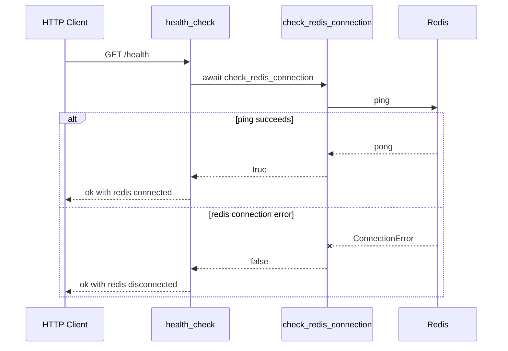

# Backend Service

The backend is the only implemented server-side runtime in ContextPortal. It is a Python 3.12 FastAPI service under `backend/` with a single health endpoint and a Redis connectivity helper. It does not yet implement authentication, connectors, context creation, token delivery, or protected resource retrieval.

## Ownership and entrypoints

| Concern | Owning file or symbol | Notes |
| --- | --- | --- |
| ASGI app | `backend/app/main.py`, `app` | `FastAPI(title=settings.app_name)` creates the application. |
| Health API | `backend/app/main.py`, `health_check()` | Registered at `GET /health`. |
| Settings | `backend/app/config.py`, `Settings`, `settings` | Provides `app_name` and `redis_url`. |
| Redis client | `backend/app/redis.py`, `redis_client` | Created with `redis.from_url(settings.redis_url, decode_responses=True)`. |
| Redis probe | `backend/app/redis.py`, `check_redis_connection()` | Awaits `redis_client.ping()` and converts `redis.ConnectionError` to `False`. |
| Focused test | `backend/tests/test_health.py` | Intended to assert `/health` returns 200 and `status: ok`; currently contains a typo. |

Run locally from `backend/` with:

```bash
uv sync
uv run uvicorn app.main:app --reload
```

## Current API surface

### `GET /health`

`health_check()` calls `check_redis_connection()` and returns JSON:

```json
{
  "status": "ok",
  "redis": "connected"
}
```

or, when Redis cannot be pinged:

```json
{
  "status": "ok",
  "redis": "disconnected"
}
```

The HTTP status remains 200 in both branches because no exception is raised from `health_check()` when Redis is unavailable.



This sequence shows the complete implemented backend request path.

## Dependencies

`backend/pyproject.toml` defines runtime dependencies:

- `fastapi` for the API framework;
- `uvicorn[standard]` for local ASGI serving;
- `redis[hiredis]` for async Redis access;
- `pydantic-settings` for environment-backed settings;
- `httpx`, currently only used by tests via `AsyncClient`.

Development dependencies are `pytest`, `pytest-asyncio`, `pytest-cov`, `ruff`, and `mypy`.

## Invariants and failure behavior

- `redis_client` is created at import time using `settings.redis_url`; changing `REDIS_URL` after import does not reconfigure the already-created client.
- `check_redis_connection()` only catches `redis.ConnectionError`. Other exceptions would propagate.
- The health endpoint separates application liveness from Redis readiness by returning `status: ok` even if Redis is disconnected.
- No request IDs, structured logging, or readiness endpoint are implemented yet.

## Tests and validation

The intended focused test is `backend/tests/test_health.py`: it constructs an `httpx.AsyncClient` with ASGI transport and asserts `/health` returns 200 and `status == "ok"`. However, the file imports `ASGITransport` but uses `ASITransport`, so the test is expected to fail with a name error until corrected.

Useful commands from `backend/`:

```bash
uv run pytest
uv run ruff check .
uv run mypy app
```

Because the current health test expects Redis may be disconnected, it does not require Docker Redis to be running. To validate the connected branch manually, start Redis from the repository root with `docker compose up -d` before starting the backend.