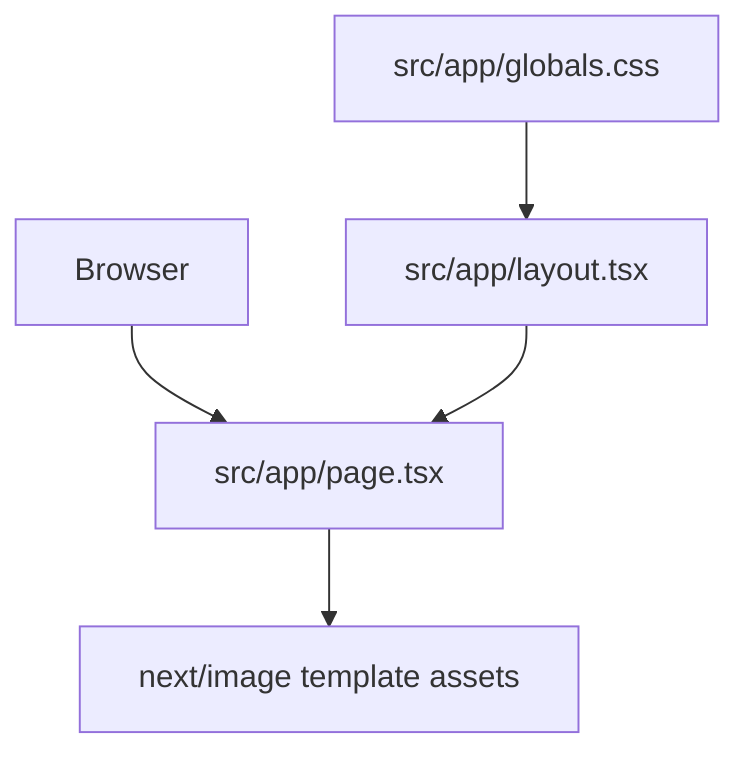

# Frontend Application

The frontend is a Next.js 16 App Router application under `frontend/`. It is currently a create-next-app scaffold, not a ContextPortal-specific user experience. It does not yet provide protected URL input, authentication status, processing, context-ready output, or integration with the backend.

## Manifest and scripts

`frontend/package.json` defines:

| Script | Purpose |
| --- | --- |
| `pnpm dev` | Start the Next.js development server. |
| `pnpm build` | Build the production Next.js app. |
| `pnpm start` | Run the built app. |
| `pnpm lint` | Run ESLint. |

Runtime dependencies are `next`, `react`, and `react-dom`. Development dependencies include TypeScript, Tailwind CSS, ESLint, and Next.js ESLint config.

## App Router files

| File | Responsibility | Current status |
| --- | --- | --- |
| `frontend/src/app/layout.tsx` | Root HTML/body layout, fonts, metadata | Imports `Geist` and `Geist_Mono` from `next/font/google`, creates CSS variables `--font-geist-sans` and `--font-geist-mono`, sets `lang="en"`, and still uses create-next-app metadata: title `Create Next App`, description `Generated by create next app`. |
| `frontend/src/app/page.tsx` | Home route component | Displays the default Next.js logo, the prompt to edit `page.tsx`, links labeled `Templates` and `Learning`, and buttons labeled `Deploy Now` and `Documentation`. |
| `frontend/src/app/globals.css` | Tailwind import, color variables, font theme | Imports Tailwind, defines light/dark `--background` and `--foreground`, maps font theme variables to the Geist CSS variables, and sets body defaults. |
| `frontend/src/app/favicon.ico` | Browser favicon | Template asset. |



This diagram shows the implemented frontend composition. There is no backend API call in this composition yet.

## Product workflow gap

`IMPLEMENTATION_PLAN.md` describes future screens: Home, Authentication, Processing, and Context Ready. None are implemented beyond the default home route. In particular, the frontend currently lacks:

- a protected URL form;
- client-side URL validation;
- calls to the FastAPI backend;
- authentication/session status UI;
- context token or context URL display;
- error handling for expired, revoked, or unauthorized context.

Future frontend work should be driven by backend APIs after the security and session foundations exist; do not invent client-only flows that bypass the architecture in `AGENT_RULES.md`.

## Validation

From `frontend/`:

```bash
pnpm install
pnpm dev
pnpm lint
pnpm build
```

The repository has no frontend tests yet. Add tests when implementing ContextPortal-specific UI state or API behavior.