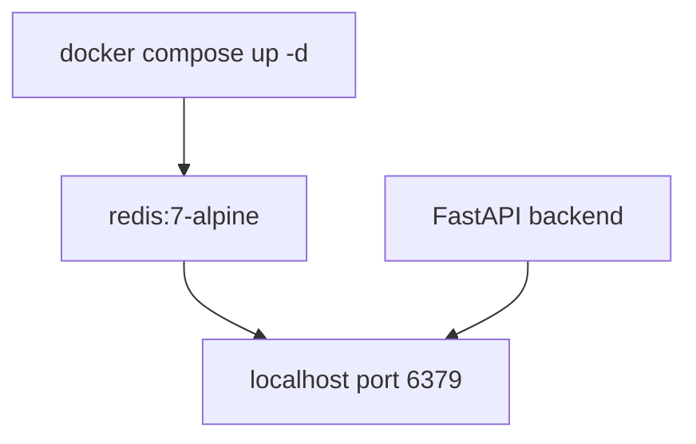

# Local Runtime and Infrastructure

The current runtime infrastructure is minimal and Redis-centered, matching ADR-001's decision to defer PostgreSQL and use Redis for ephemeral state.

## Docker Compose

`docker-compose.yml` defines one service:

| Service | Image | Port mapping | Command | Purpose |
| --- | --- | --- | --- | --- |
| `redis` | `redis:7-alpine` | `6379:6379` | `redis-server --appendonly yes` | Local Redis for backend connectivity and future ephemeral state. |

There is no PostgreSQL service, browser worker service, backend container, or frontend container in the current compose file.



This diagram shows the only implemented local infrastructure dependency.

## Local startup

The root `README.md` documents this local sequence:

```bash
docker compose up -d
cd backend
uv sync
uv run uvicorn app.main:app --reload
cd ../frontend
pnpm install
pnpm dev
```

The backend defaults to `redis://localhost:6379`, so the compose Redis service matches the default `REDIS_URL`.

## Environment placeholders

`.env.example` contains only non-secret placeholders for `APP_NAME` and `REDIS_URL`. Do not add real secrets or credentials to that file.

## GitHub Actions

`.github/workflows/openwiki-update.yml` is an OpenWiki documentation update workflow, not product CI. It runs on `workflow_dispatch` and on a daily scheduled cron (`0 8 * * *`) with `contents: write` and `pull-requests: write` permissions. The checkout step uses `actions/checkout` with `fetch-depth: 0` so OpenWiki can diff against prior documented commits. It sets up Node.js 22, then runs:

```bash
npm install --global openwiki@0.3.3 mermaid@11.16.0 jsdom@29.1.1
openwiki code --update --print
```

The OpenWiki run is configured with `OPENWIKI_PROVIDER=openai-chatgpt`, `OPENWIKI_MODEL_ID="gpt-5.5"`, `OPENWIKI_LANGSMITH_API_KEY` from repository secrets, optional `LANGSMITH_API_KEY`, `LANGCHAIN_PROJECT=openwiki`, and `LANGCHAIN_TRACING_V2=true`. The generated pull request is limited to these `add-paths`: `openwiki`, `AGENTS.md`, `CLAUDE.md`, and `.github/workflows/openwiki-update.yml`. App source and test paths are not included. The workflow does **not** run backend pytest, Ruff, mypy, frontend linting, frontend builds, security tests, or product CI.

## Implemented versus planned infrastructure

Implemented:

- local Redis through Docker Compose;
- local backend and frontend run commands;
- documentation automation for OpenWiki updates.

Planned or absent:

- production Dockerfiles;
- backend/frontend/browser-worker containers;
- product CI checks;
- PostgreSQL, intentionally deferred by ADR-001;
- deployment configuration, monitoring, rate limiting, and backup policies.

## Validation

From the repository root:

```bash
docker compose up -d
docker compose ps
```

Then start the backend and call `GET /health`; when Redis is reachable, the JSON body should include `"redis": "connected"`.