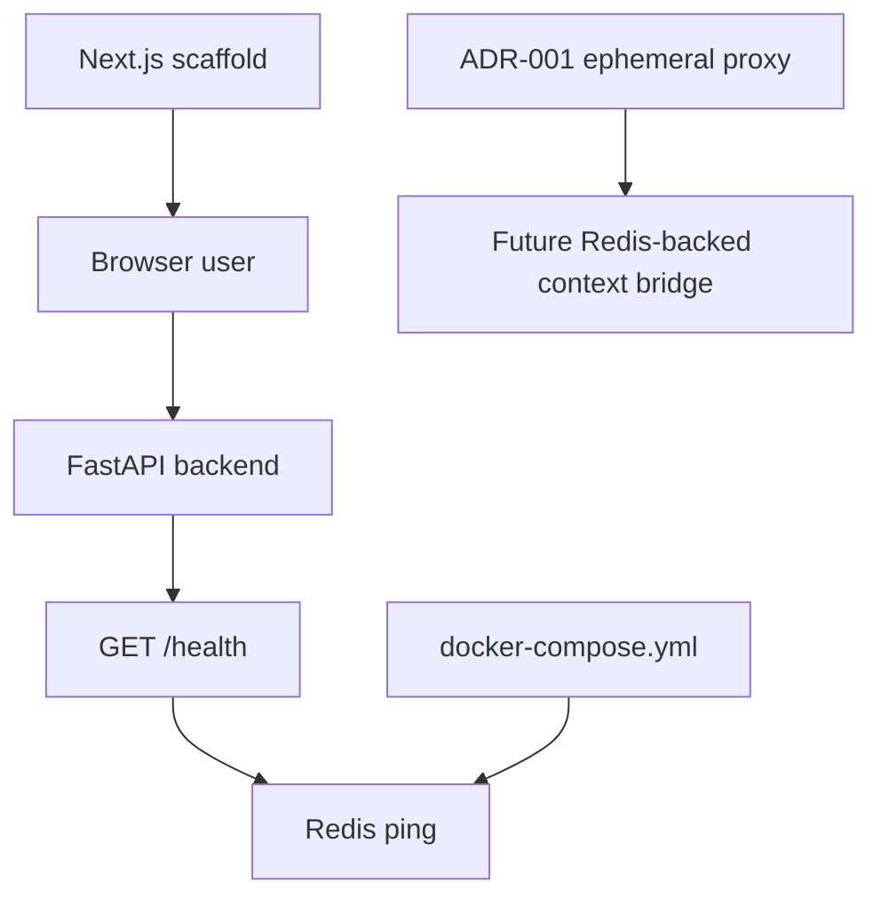

# ContextPortal Quickstart

ContextPortal is intended to turn authenticated resources into agent-readable context without becoming a permanent private-data warehouse. The current repository is an early bootstrap: FastAPI backend, Next.js frontend scaffold, Redis local infrastructure, and source-of-truth architecture documents. The protected-resource bridge, connector/browser system, context tokens, and agent endpoint are planned but not implemented yet.

For product truth and agent behavior rules, defer to `PROJECT_SPEC.md`, `AGENT_RULES.md`, `IMPLEMENTATION_PLAN.md`, and `decisions/ADR-001-ephemeral-context.md`. This wiki documents how the repository is currently implemented.

## Current implementation map



This diagram separates implemented bootstrap runtime from the future context bridge direction.

## Major wiki sections

| Page | Use it for |
| --- | --- |
| [Architecture Overview](architecture/overview.md) | High-level current architecture, implemented flow, and planned-but-absent bridge responsibilities. |
| [Decisions and Implementation Status](architecture/decisions-and-status.md) | Source-of-truth hierarchy and implemented-versus-planned matrix. |
| [Backend Service](backend/service.md) | FastAPI app, `/health`, Redis probe, dependencies, tests, and API behavior. |
| [Backend Configuration](backend/configuration.md) | `APP_NAME`, `REDIS_URL`, Pydantic settings, `.env` behavior, and secret boundaries. |
| [Frontend Application](frontend/app.md) | Current Next.js template app, layout, global CSS, scripts, and missing product UI. |
| [Local Runtime and Infrastructure](infrastructure/local-runtime.md) | Docker Compose Redis, local startup, environment placeholders, and OpenWiki workflow. |
| [Security Boundaries](security/implemented-boundaries.md) | Implemented absence-based safety, required future SSRF/session/token controls, and safe-change checklist. |
| [Development and Testing Workflows](workflows/development-and-testing.md) | Local commands, backend/frontend validation, known test typo, and CI gaps. |
| [Implementation Status and Next Development Areas](roadmap/implementation-status.md) | Roadmap alignment, ADR-driven PostgreSQL deferral, and next likely work. |

## What works today

- `docker compose up -d` starts Redis 7 Alpine on `localhost:6379`.
- `uv run uvicorn app.main:app --reload` starts the FastAPI backend from `backend/`.
- `GET /health` returns `status: ok` and reports Redis as `connected` or `disconnected` in the JSON body.
- `pnpm dev` starts the template Next.js frontend from `frontend/`.
- OpenWiki update automation exists in GitHub Actions.

## What is not implemented yet

- authentication/session infrastructure;
- protected URL submission or retrieval;
- SSRF validator;
- browser automation or Playwright connector;
- content extraction and Markdown normalization;
- context-token generation, hashing, expiration, or revocation;
- `GET /c/{token}` agent endpoint;
- PostgreSQL models, migrations, or service;
- product CI for backend/frontend checks.

## Task routing table

| Intent or change area | Start with wiki page | Owning source entrypoints | Focused tests/checks | Minimal validation |
| --- | --- | --- | --- | --- |
| Understand current architecture | [Architecture Overview](architecture/overview.md) | `backend/app/main.py`, `frontend/src/app`, `docker-compose.yml`, ADR-001 | N/A | Read [Decisions and Implementation Status](architecture/decisions-and-status.md) too. |
| Change health endpoint behavior | [Backend Service](backend/service.md) | `backend/app/main.py`, `backend/app/redis.py` | `backend/tests/test_health.py` after fixing `ASITransport` typo | `cd backend && uv run pytest` |
| Change Redis URL or app name behavior | [Backend Configuration](backend/configuration.md) | `backend/app/config.py`, `.env.example` | Add/adjust settings tests if behavior changes | `cd backend && uv run pytest && uv run mypy app` |
| Work on frontend UI | [Frontend Application](frontend/app.md) | `frontend/src/app/page.tsx`, `layout.tsx`, `globals.css` | Add tests when product UI appears | `cd frontend && pnpm lint && pnpm build` |
| Work on local runtime | [Local Runtime and Infrastructure](infrastructure/local-runtime.md) | `docker-compose.yml`, `.env.example` | Manual health check | `docker compose up -d`, then backend `/health` |
| Add URL retrieval, auth, sessions, or tokens | [Security Boundaries](security/implemented-boundaries.md) | New security/auth/connector modules; none exist yet | Negative tests for SSRF, isolation, expiration, revocation | Do not ship before tests and security checklist pass. |
| Decide next implementation slice | [Implementation Status and Next Development Areas](roadmap/implementation-status.md) | Plan docs plus current code | Phase-specific tests | Keep scope small and ADR-aligned. |
| Improve CI | [Development and Testing Workflows](workflows/development-and-testing.md) | `.github/workflows/` | Backend pytest/Ruff/mypy; frontend lint/build | Ensure workflow runs product checks, not only OpenWiki. |

## Local bootstrap commands

```bash
# Infrastructure
docker compose up -d

# Backend
cd backend
uv sync
uv run uvicorn app.main:app --reload

# Frontend
cd ../frontend
pnpm install
pnpm dev
```

Focused validation commands:

```bash
cd backend
uv run pytest
uv run ruff check .
uv run mypy app

cd ../frontend
pnpm lint
pnpm build
```

Known caveat: the current backend health test references `ASITransport` instead of the imported `ASGITransport`, so fix that before expecting `uv run pytest` to pass.

## Backlog and valid deferrals

- **Fix backend health test**: `backend/tests/test_health.py` has a transport typo. Reason: the only backend test does not currently exercise the endpoint.
- **Product CI**: `.github/workflows/openwiki-update.yml` only updates docs. Reason: no workflow enforces pytest/Ruff/mypy or frontend lint/build.
- **Readiness endpoint**: `PROJECT_SPEC.md` mentions `/health` and `/ready`; code only implements `/health`. Reason: Redis disconnected is currently reported in the body, not as readiness failure.
- **Security foundations**: SSRF validation, token primitives, and session isolation are required before URL fetching. Reason: `AGENT_RULES.md` makes these security requirements functional blockers.
- **Redis key lifecycle design**: ADR-001 assigns temporary sessions, tokens, revocation, rate limiting, and short content cache to Redis, but no key schema exists yet.
