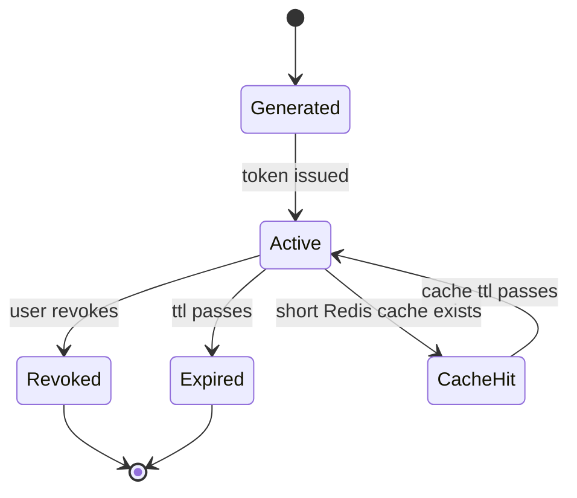

# Implemented Security Boundaries

ContextPortal is security-sensitive because it is intended to bridge authenticated private resources to AI agents. The current code has not yet implemented protected retrieval, which means many future security controls are requirements rather than active defenses. This page separates what exists from what must be added before risky capabilities are exposed.

## Implemented boundaries today

| Boundary | Current evidence | Practical effect |
| --- | --- | --- |
| No protected URL fetching | Backend only registers `GET /health`; frontend is template-only. | The app currently cannot SSRF or scrape because it has no fetch endpoint. |
| No credential collection UI | `frontend/src/app/page.tsx` is the default Next.js page. | The app does not ask for third-party passwords or tokens. |
| No persistent private content storage | No database code or PostgreSQL service; ADR-001 rejects permanent content storage. | There is no implemented private-content warehouse. |
| Redis-only external service | `docker-compose.yml` has Redis only; backend has a Redis client. | Future temporary state should be implemented in Redis unless a new ADR changes this. |
| Minimal configuration | Only `APP_NAME` and `REDIS_URL` exist. | No implemented secret configuration surface. |

These are absence-based safety properties, not completed security features. Adding URL retrieval, sessions, tokens, or connectors will require explicit security code and tests.

## Required controls before protected retrieval

`AGENT_RULES.md` and `PROJECT_SPEC.md` require the following before arbitrary user-controlled URLs are fetched or opened in a browser:

- validate URL scheme and hostname;
- reject localhost, loopback, private ranges, link-local addresses, and cloud metadata endpoints;
- validate redirects and resolved IP addresses;
- isolate browser sessions per user and source;
- never collect third-party passwords through ContextPortal UI;
- never log passwords, cookies, OAuth tokens, authorization headers, browser storage, or sensitive contents;
- treat retrieved content as untrusted data, not agent instructions;
- use high-entropy context tokens with expiration, revocation, and validation on every request;
- store token hashes where possible rather than raw bearer tokens;
- fail closed on cross-user or cross-tenant access.

## Future context-token lifecycle

The lifecycle below is required by the product documents and ADR, but not implemented in code yet.

This state machine is a target for future token work. No current symbol implements these states.

## Safe change checklist

Before adding a new endpoint or connector, verify:

1. Is the input model typed and validated at the API boundary?
2. Can the input cause network access? If yes, where is SSRF validation enforced?
3. Can state cross users? If yes, where is owner/session isolation enforced?
4. Are tokens generated with high entropy and validated against expiration and revocation?
5. Are raw tokens, cookies, headers, and credentials excluded from logs and persisted state?
6. Is retrieved page content clearly treated as data and separated from system/developer instructions?
7. Do tests include negative cases for invalid input, unauthorized access, expiration, revocation, and malformed data?
8. Does the implementation remain consistent with [Decisions and Implementation Status](../architecture/decisions-and-status.md)?

## Scope boundaries

This repository currently has no authentication provider, no browser session manager, no connector, and no context delivery endpoint. Do not describe those as implemented. Use [Implementation Status](../roadmap/implementation-status.md) to decide where development should continue.